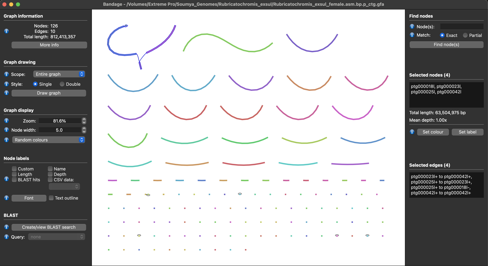
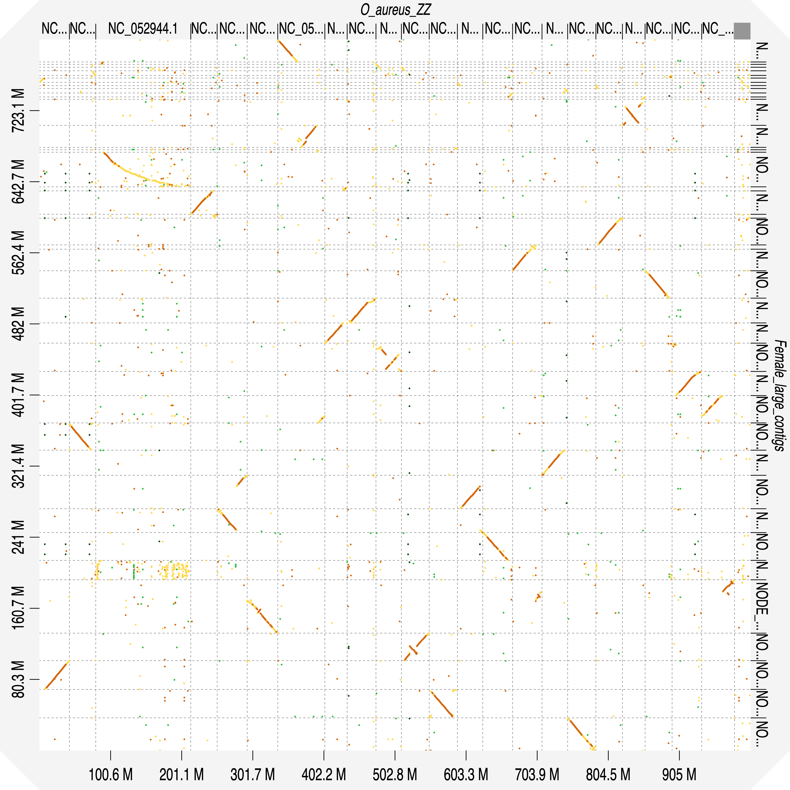

# Cracking the Cichlid Code: A Genome Assembly Workflow
From June 2024 to early 2025, I had the wonderful opportunity to work with the Kocher Biology Lab where they focus on evolutionary traits and patterns in cichlids (fish!). I worked under Professor Tom Kocher and my mentor Kristen Behrens as we wrapped up the lab's final projects. My main contribution was genome assembly, so I want to showcase the process and some of the scripts I was able to write to automate certain steps in the workflow. I used Bash to script and automate tasks within a Unix environment

Let's walk through the process with an example genome -- we'll see if we can piece together the data from a female Rubricatochromis exsul -- here's what she might look like, by the way:

## Step 1: Initial Assembly
First, we take the raw sequencing reads and use a script to run a fast de novo assembler called [Hifiasm](https://github.com/chhylp123/hifiasm). The output is a .gfa file, a tab-delimited text format to describe sequences and their overlap. We can easily take a look at the initial assembly with [Bandage](https://rrwick.github.io/Bandage/) which is a neat tool for visualising de novo assembly graphs. Let's see how our assembly looks:

Hm, looks pretty solid! We now have a set of contigs, which are continuous sequences of DNA formed by joining overlapping fragments. As you can see, sometimes the assembler isn't sure about joining two contigs. We just use our judgement to manually make the join that seems more likely or produces a longer chromosome (this can be reversed if problems are found later in the process).

Now, we save each contig (excluding the smaller ones that are < 2 Mb) to prepare for the next steps :)

## Joining contigs
Most cichlids have fusions that give them chromosomes, or linkage groups, numbered 1 to 23 (minus 21). Now, to figure out how to accurately piece these contigs together into 22 linkage groups, we align against a reference genome using [Dgenies](https://dgenies.toulouse.inra.fr/), a wonderful tool that visualizes genome alignments. It uses minimap2 and produces a plot, here's an initial run using all of our saved Rubricatochromis contigs aligned against a Oreochromis Aureus reference:

You can get a more interactive look as well with this [live viewer](https://github.com/SoumyaJailwala/Genome-Assembly/Example_Genome_Data/Female_large_contigs_O_aureus_ZZ_RE_F.html).

Cool! We can see which linkage group each contig aligns to, and how well it aligns. 
Let's take a closer look at 

Reversing like so:
`seqkit seq -r -p -t DNA female_contig9.fasta -o female_contig9_reversed.fasta`

Now, we have to join the two contigs together - but each .fasta file has a header line, and we don't want both the headers in the final output. So, we use `grep` to remove the header of the second contig, contig8:

`grep -v ">" female_contig8.fasta > female_contig8_noheader.fasta`
cat female_contig20.fasta Ns.fasta female_contig31_reversed_noheader.fasta > female_contig20_31_reversed.fasta 

## Telomere Analysis
Telomeres are repetive sequnces at the end of chromsoems 

[Dgenies](https://dgenies.toulouse.inrae.fr/).
