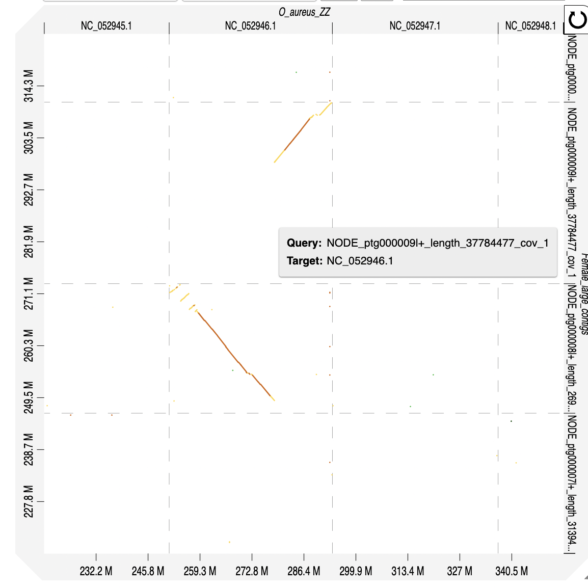

# Cracking the Cichlid Code: A Genome Assembly Workflow
From June 2024 to early 2025, I had the wonderful opportunity to work with the Kocher Biology Lab at the University of Maryland. I worked under Professor Tom Kocher and my mentor Kristen Behrens as we wrapped up the lab's final projects, focusing on genome assembly and uncovering patterns in sex determination in cichlids (fish!). Here, I showcase the process of genome assembly and some scripts I wrote to automate steps in the workflow. 

Feel free to take look at [some scripts I've written!](My_Scripts/) I used Bash to script and automate tasks within a Unix environment.


## A Walkthrough
Let's walk through the process with an example genome. We'll see if we can piece together the data from a female Rubricatochromis exsul:


## Step 1: Initial Assembly
First, we take the raw sequencing reads and use a script to run a fast de novo assembler called [Hifiasm](https://github.com/chhylp123/hifiasm). The output is a .gfa file, a tab-delimited text format to describe sequences and their overlap. We can easily take a look at the initial assembly with [Bandage](https://rrwick.github.io/Bandage/) which is a neat tool for visualising de novo assembly graphs. Let's see how our assembly looks:


Hm, looks pretty solid! We now have a set of contigs, which are continuous sequences of DNA formed by joining overlapping fragments. Now, we save each contig (excluding the smaller ones that are < 2 Mb) to prepare for the next steps :)

## Align Against a Reference
Now, to figure out how to accurately piece these contigs together into distinct linkage groups (another word for chromosomes - cichlids have 22!), we align against a reference genome using [Dgenies](https://dgenies.toulouse.inra.fr/), a wonderful tool that visualizes genome alignments. It uses minimap2 and produces a plot; Here's an initial alignment of all of our saved Rubricatochromis contigs against an Oreochromis Aureus reference:


You can get a more interactive look as well with this [live viewer](Example_Genome_Data/Female_large_contigs_O_aureus_ZZ_RE_F.html).

Cool! We can now see which linkage group each contig aligns to, and how well it aligns. 


## Breaking, Reversing, Joining Contigs

Let's take a closer look at LG5.



It looks like we have both contig8 and contig9 aligning to this linkage group. There's a few steps we need to take before joining the two.

First, a closer look at contig9 reveals only part of it is aligning to LG5 and the other is aligning all the way to LG13.

We only want that second chunk that is aligning to LG5.
This means we'll have to split the contig. Getting a breakpoint from the Dgenies plot, we can split like so::

```
seqtk subseq male_contig10.fasta <(echo -e "NODE_ptg000010l+_length_59099632_cov_1\t1\t16600000") > female_contig9_part1.fasta
seqtk subseq male_contig10.fasta <(echo -e "NODE_ptg000010l+_length_59099632_cov_1\t16600001\t59099632") > male_contig9_part2.fasta
```

Check out my [script that streamlines splitting contigs!!!](My_Scripts/split_contig.sh)

Now that we have the right part of contig9, we have to reverse it because you'll see it's going a different way than contig8 if you look back.

Simply reverses the DNA sequence:
`seqkit seq -r -p -t DNA female_contig9_part1.fasta -o female_contig9_part1_reversed.fasta`

Now, we have to join the two contigs together - but each .fasta file has a header line, and we don't want both the headers in the final output. So, we use `grep` to remove the header of the second contig in our join, which is contig8:

```
grep -v ">" female_contig8.fasta > female_contig8_noheader.fasta
```

Now we can finally join it all together!! 

```
cat female_contig9_part2_reversed.fasta Ns.fasta female_contig8_noheader.fasta > female_contig9_part2_reversed_8.fasta
```
Check out my [script that streamlines these steps in joining contigs!!!](My_Scripts/join_contigs.sh)

`female_contig9_part2_reversed_8.fasta` will now be our final .fasta file for LG5!

## Create v1 genome
After repeating the process of joining contigs for all linkage groups, making breaks and reversals if possible, we are ready to create a version 1 genome.

This will concatenate all of our final contigs into one single genome file (the .txt has the names of the final .fasta files):

```
cat Female_list_v1.txt | xargs cat > RE_female_genome_v1.fasta
```

## Telomere Analysis With tidk
Telomeres are repetive sequences at the end of chromosomes. We want to make sure we don't have any telomeres in the middle of our assembled linkage groups - that would suggest some inaccurate joins. Here's a script I wrote to find 'AACCCT', the known telomeric repeat for cichlids, using [tidk](https://github.com/tolkit/telomeric-identifier) (A Telomere Identification toolKit) :

https://github.com/SoumyaJailwala/Genome-Assembly/blob/09760c9b14682d6b152994f70e69392ef4c8ec2c/My_Scripts/run_tidk_search.sh#L1-L13

Running tidk on our newly assembled female Rubricatochromis genome gives us plots like this for each linkage group we put together:


[Dgenies](https://dgenies.toulouse.inrae.fr/).
